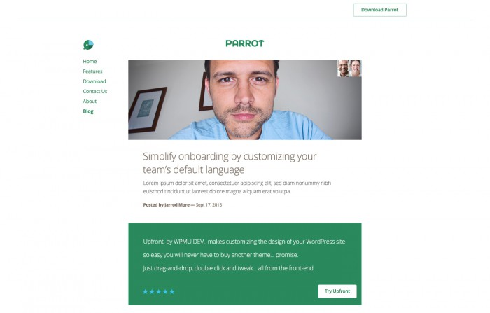
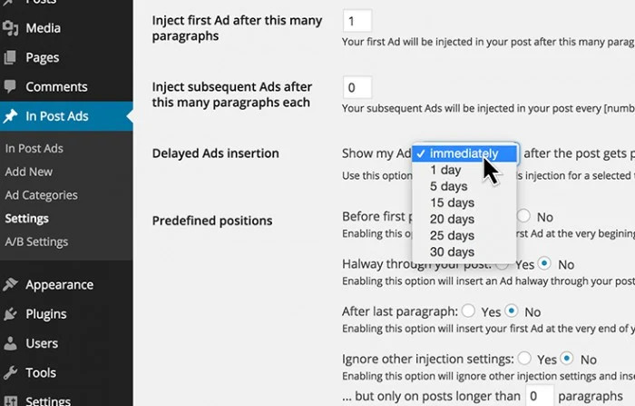
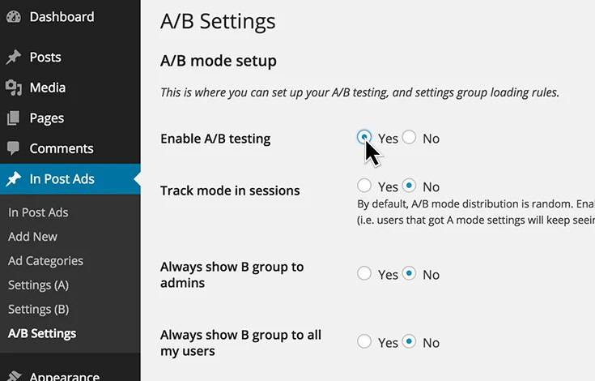
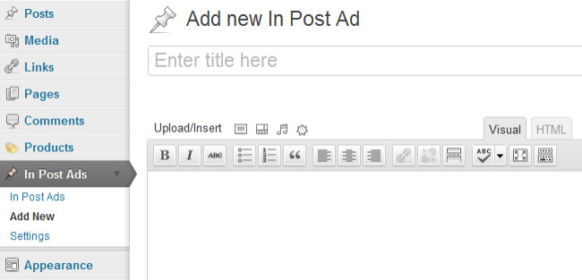

<h2 align="center" style="color:#38c2bb;">📚 PS BeitragsAds</h2>

  <a href="https://github.com/cp-psource/e-newsletter/discussions" style="color:#38c2bb;">💬 Forum</a>
  <a href="https://github.com/cp-psource/e-newsletter/releases" style="color:#38c2bb;">📝 Download</a>

Definiere benutzerdefinierte Werbeanzeigen für Beitragstypen und mehr, das einfachste Werkzeug um effektiv Werbeanzeigen zu schalten.

## PS BeitragsAds platziert Anzeigen dort, wo Nutzer am meisten mit Ihren Inhalten interagieren.

Besucher können für Banner- und Seitenleistenwerbung blind sein. PS BeitragsAds löst dieses Problem, indem es unauffällige Anzeigen in den Inhalt Deiner Webseite einfügt.

  Einfache Anzeigen, die den Inhalt Deines Beitrags ergänzen.

### Werbung, die nicht nervt

PS BeitragsAds verwendet genau die richtige Menge an Pop, ohne Deinen Inhalt zu beeinträchtigen. Beginne mit einem integrierten Stil oder erstelle einen benutzerdefinierten Look. Biete angemeldeten Nutzern ein werbefreies Leseerlebnis und ermutige Besucher zum Upgrade.

  Unglaubliche, einfache Steuerelemente zum Anzeigen von Anzeigen basierend auf Deinen spezifischen Anforderungen.

### Echte Kontrolle

Füge Anzeigen dort ein, wo Du möchteat, nach dem Zufallsprinzip oder in einer vordefinierten Reihenfolge. Löse die Anzeige mithilfe von Kategorien, Tags und Beitragstypen aus. Schalte Anzeigen direkt bei der Veröffentlichung eines Beitrags oder erst, nachdem er einige Tage online war.

  Vermarkte wie ein Profi mit integrierten A/B-Tests.

### Finde heraus, was am besten funktioniert

Erziele höhere Conversion-Raten mit integrierten A/B-Tests. Teste zwei völlig unterschiedliche Konfigurationen und finde heraus, welche Anzeigen an welcher Stelle am besten funktionieren. Integriere Google Analytics, um das ultimative WordPress-Marketingerlebnis zu schaffen.

Generiere mehr Umsatz und steigere den Umsatz, indem Du mit PS BeitragsAds automatisch Anzeigen in Deine Beiträge einfügst.

## Verwendung

### **Installieren:**

- Gehe nach der Aktivierung zum PS-BeitragsAds-Menü, um die Einstellungen anzupassen.

